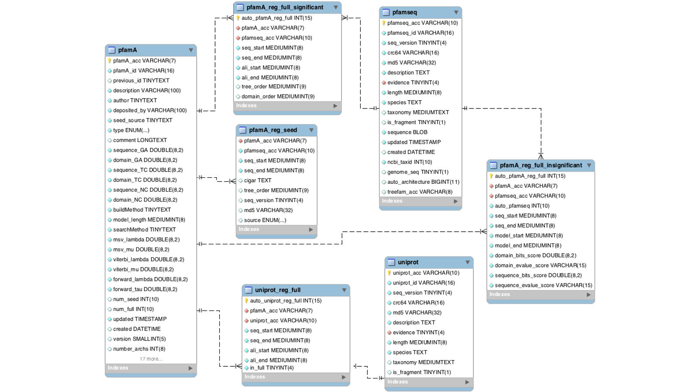

## Sobre el curso

- Acerca del docente
  - ¿Quién soy?
  - ¿Cuál es mi formación?
  - ¿A qué me dedico?
- Organización de las clases
  - Horario
  - Google classroom
  - Vías de comunicación
- Evaluaciones
  - Trabajo final

## ¿Cómo está organizado el curso?

Primer encuentro:

- Algunos conceptos teóricos.
- Interactuar manualmente con diferentes bases de datos.
  - Consultas básicas y avanzadas.

Segundo encuentro:

- Introducción al lenguage de python.
- Acceso programático a bases de datos.

Tercer encuentro:

- Acceso programático a bases de datos.
- Ejercicios de acceso programático a bases de datos.

## ¿Cómo vamos a trabajar en el curso?

- Vamos a trabajar con Jupyter notebooks en la plataforma Colab de Google.
- Trabajo final con evaluación a entregar quince días a un mes después del
  último encuentro.

## Antes de empezar

- Expectativas
- Conocimientos previos esperados
  - Conocimientos básicos de programación
  - Conocimientos básico de bioquímica de macromoléculas

## Objetivos generales

- \cmkg Comprender la estructura y función de las principales bases de datos
  biológicas.
- \cmkg Recuperar y analizar datos biológicos utilizando diversas herramientas y
  técnicas de programación.
- \cmkb Integrar datos de múltiples fuentes para la investigación biológica.

## Temas específicos

- Introducción general a las bases de datos biológicas
- Revisión de bases de datos particulares
  - \ldots de Secuencias de Ácidos Nucleicos / Proteinas
  - \ldots de Genómica Funcional y Expresión Génica
  - \ldots de Vías Metabólicas y Biología de Sistemas
  - \ldots de Estructuras 3D de proteinas
  - \ldots de Variación Genómica y Enfermedades
  - \ldots de interacciones
- Acceso Programático a Bases de Datos Biológicas

## ¿Cuál es nuestro enfoque?

- Al trabajar con bases de datos podemos tomar distintos roles
  - **\textcolor{red}{Usuario / Consumidor}**
    - **\textcolor{red}{Perfil científico}**: Colectar ciertos tipos de datos
      para hacer análisis reproducibles
    - **\textcolor{red}{Perfil desarrollador}**: Queremos desarrollar una
      aplicación que tome datos de otras bases de datos para mostrarlos,
      analizarlos, etc
  - Curador
  - Generador de datos
  - Desarrollador

## <!--- Empty title 2 -->

\begin{center}
\Huge
Introducción a las Bases de Datos Biológicas
\end{center}

## ¿Qué es una base de datos biológica?

- Una colección estructurada de información sobre macromoléculas biológicas,
  como ADN, ARN y proteínas, u otras entidades biológicas.
- Facilitan el acceso, almacenamiento, búsqueda y análisis de datos biológicos.
- ¿Pero **qué** es una base datos?
  - Colección de datos
  - Sistema de gestión de bajo nivel de los datos
  - Interfaces de interacción
    - Web
    - API (Application Programming Interface)
  - Pero a hay mucho heterogeneidad...
    - Páginas web...
    - Archivos sueltos...
    - Aplicaciones especializadas...

## Bases de datos primarias

- Las bases de datos primarias contienen datos derivados experimentalmente:
  - Secuencias de nucleótidos
  - Secuencias de proteínas
  - Estructuras macromoleculares
- Los resultados experimentales son enviados directamente a la base de datos por
  los investigadores
- La base de datos funciona como un archivo
- Una vez que se les asigna un número de acceso en la base de datos, los datos
  en las bases de datos primarias nunca se cambian
- Los ejemplos más comunes son **GenBank** o **PDB**

## Bases de datos secundarias

- Contienen datos derivados, curados y anotados a partir de bases primarias,
  o de otras bases de datos secundarias.
- Ejemplo: **UniProtKB/Swiss-Prot**, que almacena información detallada sobre
  proteínas con anotaciones de función y estructura.
- Permiten realizar análisis más avanzados gracias a la organización y
  validación de datos.
- Los analisis basados en estas bases de datos suelen ser más repetibles gracias
  a su versionado.

## Bases de datos específicas/compuestas

- Contienen información sobre tópicos específicos
  - por ejemplo un organismo modelo
- Colectan información agregada de varias otras bases de datos
- Combinan varios aspectos que biológicamente están relacionados, pero cuyos
datos provienen de diferentes fuentes.

Por ejemplo:

- TAIR (The Arabidopsis Information Resource)
- IntAct DB

## Diferentes aspectos de una base de datos biológica

- Desde el punto de vista informático (consulta/desarrollo)
  - Estructura de los datos.
  - Modos de acceso programático.
  - Límites en las consultas.
  - Estrategias específicas para manipular datos biológicas.

- Desde el punto de vista de usuario biólogo.
  - Interfaz de usuario.
  - Origen biológicos de los datos.
  - Interacción con otras bases de datos.
  - Diferencias entre bases de datos similares.

## Sistemas de gestión de bases de datos

- Hay dos categorias principales para classificar los sistemas de gestión de
  datos generales.
  - SQL: Bases de datos basadas en tablas.
  - NoSQL: Bases de datos basadas en documentos, clave-valor o grafos.
- Pero no son las únicas formas.
  - ALgunas de las bases de datos biológicas más importantes no caen en estas
    categorias.

## Sistemas SQL

- Los datos se organizan en tablas.
  - Tipicamente, hay un tabla para cada tipo de entidad que se quiere describir
    - Por ejemplo: Una tabla para describir proteínas, y otra tabla para
      describir variantes.
    - Cada entidad recibe un **índice** único que la identifica
    - Las columnas de la tabla son descriptores de la entidad.
    - Todos las entidades comparten estos descriptores.
  - Las entidades se relacionan entre si por medio de **índices**.

## Ejemplo SQL DB

\begin{center}
  \includegraphics[width=0.70\textwidth]{
    ./images/sql-table.pdf
  }
\end{center}

## Ejemplo de Pfam

## Sistema NoSQL

- No sigue el esquema de tablas.
- Agrupa a varios tipos de bases de datos
  - Clave/valor: Sirve para almacenar datos genéricos que generalmente no
    comparten una estructura común y pueden no tener nada que ver.
  - Grafos: Los datos se almacenan como nodos, y relaciones entre ellos conectan
    a los nodos. Sirve para almacenar datos de relaciones entre entidades.
  - Documentos: Sirve para almacenar datos genéricos que generalmente están
    relacionados o son del mismo tipo, pero que por la complejidad de los
    descriptores que tienen son muy difíciles de adaptar a un esquema SQL.

## Ejemplo Key/value DB

\begin{center}
  \includegraphics[width=0.60\textwidth]{
    ./images/keyval-db.pdf
  }
\end{center}

## Ejemplo Graph DB

\begin{center}
  \includegraphics[width=0.70\textwidth]{
    ./images/graph-db.pdf
  }
\end{center}

## Ejemplo Document DB

\begin{center}
  \includegraphics[width=0.5\textwidth]{
    ./images/nosql-db.pdf
  }
\end{center}

## Formatos de archivos comunes

Durante el curso vamos a trabajar con diferentes tipos de archivos de datos.

- Almacenamiento de secuencias y anotaciones
  - fasta, fastq
  - GenBank, GFF, GTF
- Enviar y recibir datos de nuestras consultas.
  - JSON, XML
- Datos tabulares
  - CSV, TSV

## <!--- Empty title 3 -->

\begin{center}
\Huge
Revisión de bases de datos biológicas
\end{center}

## ¿Quién da soporte a las bases de datos biológicas?

La mayoría de las bases de datos de mayor relevancia son mantenidas directa o
  indirectamente por:

- NCBI/NLM/NIH
  - National Center of Biotechnology Information
  - National Library Of Medice
  - Nationa Institute of Health
- EBI/EMBL
  - European Bioinformatics Institute
  - European Molecular Biology Laboratory

Estas suelen ser las más genérales.

Otras son matenidas por consorcios, instituciones más pequeñas o por grupos de
investigación. Estas suelen ser las más específicas y con menor nicho de
usuarios, y con menor mantenimiento.

## <!--- Empty title 4 -->

\begin{center}
\Huge
Bases de datos se secuencias de ADN/ARN/Proteínas
\end{center}

## Genbank (NCBI)

- Es una colección anotada de secuencias de todas las secuencias de ADN que
  están publicamente disponibles.

- Es parte del consorcio INSDC (International Nucleotide Sequence Database
  Collaboration), junto con ENA (Europa) y DDBJ (Japón). Todas tienen la misma
  información.

[https://www.ncbi.nlm.nih.gov/genbank/](https://www.ncbi.nlm.nih.gov/genbank/)

## Genbank (NCBI) - Estadísticas

## RefSeq (NCBI Reference Sequence Database)

Es una colección de secuencias de referencia para:

- ADN genómico
- Transcriptos
- Proteinas

Contiene secuencias no redundantes y bien anotadas. Sirve como una marco de
referencia estables para otras bases de datos, proyectos, anotación de
variantes, etc.

[https://www.ncbi.nlm.nih.gov/refseq/](https://www.ncbi.nlm.nih.gov/refseq/)

## NCBI Nucleotide (nuccore)

Es una colección más inclusiva de secuencias de ADN y ARN.

Incluye las secuencias de GenBank, RefSeq y otras.

[https://www.ncbi.nlm.nih.gov/nuccore](https://www.ncbi.nlm.nih.gov/nuccore)

## GenBank vs nuccore

|           | GenBank                              | Nuccore                                                 |
| --------- | ------------------------------------ | ------------------------------------------------------- |
| Contenido | Secuencias enviadas públicamente con anotaciones | Colección agregada de secuencias de nucleótidos de múltiples fuentes |
| Fuentes   | Envíos de investigadores de todo el mundo | GenBank, RefSeq, otros |
| Curación  | Curación limitada, contiene entradas redundantes | Incluye secuencias de referencia curadas y de alta calidad (RefSeq) |
| Propósito | Archivo de datos de secuencias sin procesar con anotaciones | Repositorio consultable de secuencias de nucleótidos |

## Identificadores en GenBank y RefSeq

### Accession Number (AC)

- Un identificador único asignado a cada entrada de secuencia cuando se envía a
  GenBank.
- Es permanente, lo que significa que no cambia incluso si la secuencia se
  actualiza.
- Formato: código de 1-2 letras + 5-8 dígitos (por ejemplo, M12345)

### Número de Versión

- Rastrea los cambios en una secuencia.
- El número de versión se agrega al número de acceso utilizando una notación de
  punto.
- Si una secuencia se actualiza, su número de acceso permanece igual, pero el
  número de versión se incrementa.

## Identificadores en GenBank y RefSeq (cont. 1)

## Número GI (Legacy)

- Un identificador único asignado previamente a una versión específica de una secuencia.
- En desuso desde 2016 en favor del formato accession.version.
- Los números GI cambiaban cuando se actualizaba una secuencia, a diferencia de los números de acceso.

## Identificadores en GenBank y RefSeq (cont. 2)

### Identificadores RefSeq

- Utilizados para secuencias curadas y de alta calidad de la base de datos RefSeq de NCBI.
- Los IDs de RefSeq tienen prefijos estandarizados:
  - NC : Cromosomas completos (NC_000001.11)
  - NM : Secuencias de mRNA (NM_001256789.2)
  - NR : RNAs no codificantes (NR_123456.1)
  - XP : Proteínas predichas (XP_987654.1)

### Identificadores locales de secuencia (Locus)

- Un identificador corto basado en texto dentro de una entrada de GenBank.
- Asignado por quien sube los datos (no es globalmente único).
- Utilizado en archivos GenBank para organizar registros.

## Sequence Read Archive

Es una colección se secuencias generadas en experimentos de secuenciación
masiva:

- Experimentos de RNA-Seq
- Experimentos de ChIP-Seq
- Proyectos de Metagenómica
- Muestras ambientales

[https://www.ncbi.nlm.nih.gov/sra](https://www.ncbi.nlm.nih.gov/sra)

## Uniprot

- Uniprot provee secuencias y anotaciones funcionales de proteinas.
- Es el principal recurso sobre secuencias proteínas.
- Consiste de varias bases de datos:
  - Uniparc: Colección de proteinas no redundantes de la mayor parte de las
    secuencias de proteinas disponibles. La mayoría no tiene anotaciones de
    calidad.
  - UniprotKB: Colección de secuencias de proteínas con anotaciones funcionales.
    - Swiss-Prot: Contiene anotaciones curadas manualmente (~550.000)
    - TrEMBL: Contiene anotaciones generadas automáticamente (~250.000.000). No
      están revisadas a mano.
  - Proteomes: Colección de proteínas por organismo.

[https://www.uniprot.org/](https://www.uniprot.org/)

## Identificadores de Uniprot

### UniProt Accession Number (AC)

Es el identificador único y permanente de una entrada en UniProt.
Si una proteína se fusiona con otra en una nueva entrada, el número original
se mapea a la nueva entrada.
Formato:

- Una letra, un número, tres alfanuméricos y un número (O12345)
- Una letra, un número, una letra, dos alfanumŕicos y un número (A1BC23).
- Una letra, un número, (una letra, dos alfanumŕicos y un número) dos veces
  (A1B234C567).

## Identificadores de Uniprot (cont.)

### UniProt Entry Name (ID)

- Es un nombre descriptivo y único para cada entrada de proteína.
- Sigue un formato estructurado basado en el gen y la especie:
  - GENE_SPECIES (abreviado a 5 letras): THIO_ECOLI.

El Accession Number (AC) es permanente, mientras que el Entry Name (ID) puede
cambiar si la anotación de la proteína se actualiza.

### UniParc Identifiers (UPI)

- Universal Protein Archive (UniParc) asigna un identificador único a cualquier
  secuencia de proteína.
- Si la secuencia aparece en varias bases de datos (NCBI, Ensembl, etc.),
  UniParc mantiene un solo ID.
- Si la secuencia cambia, se genera un nuevo ID.  Ejemplo: UPI0000000001.

## <!--- Empty title 5 -->

\begin{center}
\Huge
Bases de datos se agrupaciones de proteínas
\end{center}

## UniRef

- Es una base de datos de proteínas que tienen similitud secuencial.
  - Clusters.
- Hay diferentes versiones según el grado de identidad de secuencia.
  - UniRef100 combina secuenias idénticas y fragmentos de cualquier organismo.
  - UniRef90 resulta del agrupamiento de secuencias de Uniref100 al 90% de
    identidad y 80% de sobreposición con la secuencia de mayor longitud.
  - Uniref50 resulta del agrupamiento de secuencias de Uniref90 al 50% de
    identidad y 80% de sobreposición con la secuencia de mayor longitud.
  - Identificador: Incluye el grado de similtud del agrupamiento y el AC de
    la proteína representatica. Ejemplo: UniRef100_P69905 (Cluster que incluye P69905 y secuencias idénticas).

[https://www.uniprot.org/uniref/](https://www.uniprot.org/uniref/)

## InterPro / Pfam

- Es una colección de dominios de familias de proteínas.
- Cada familia está representada por un alineamiento múltiple y un modelo
  oculto de Markov (HMM).
- Cada familia está definida por un pequeño alineamiento semilla, con este se
  construye un HMM. Y un alineamiento completo de todas las secuencias
  detectables a partir del HMM en bases de datos primarias de proteínas.
- Algunos conjuntos de familias se agrupan en clanes, que tienen que tener un
  origen evolutivo común.
- Pfam antes era una base de datos independiente, ahora es miembro de InterPro

[https://www.ebi.ac.uk/interpro/](https://www.ebi.ac.uk/interpro/)

\begin{center}
  \includegraphics[width=0.5\textwidth]{images/hmm.pdf}
\end{center}

## Principales identificadores en Pfam

### Pfam Accession Number (PF ID)

- Es el identificador único y permanente de cada familia de proteínas o dominio en Pfam.
- Comienza con "PF" seguido de un número de 5 dígitos (PF00069).
- Se mantiene constante aunque la anotación de la familia cambie.

### Pfam Family Name (Pfam Name)

- Es un nombre descriptivo de la familia o dominio de proteínas.
- Ejemplo: Protein_kinase → Familia de quinasas (PF00069).

### Clan Identifier (CL ID)

- Algunas familias están agrupadas en "clanes" que comparten similitudes evolutivas.
- Cada clan tiene un identificador único que comienza con "CL" seguido de un número.
- Ejemplo: CL0023 → Clan de serín-proteasas.

## <!--- Empty title 6 -->

\begin{center}
\Huge
Bases de datos de genes, genomas y variantes
\end{center}

## NCBI Gene

- Contiene datos entrelazados de distintas fuentes para un gen:
  - Mapa de la organización del gen.
  - Secuencias disponibles
  - Resultado de expresión génica
  - Transcriptos
  - Anotaciones funcionales
  - Fenotipos asociados
  - Variantes con importancia clínica

[https://www.ncbi.nlm.nih.gov/gene](https://www.ncbi.nlm.nih.gov/gene)

## Identificadores de NCBI Gene

- Gene ID (Gene Identifier)
  - Es un identificador numérico único y permanente asignado a cada gen en la base de datos Gene de NCBI.
  - No cambia, pero puede quedar obsoleto si el gen se elimina o fusiona con otro.
- Official Gene Symbol (HGNC Symbol)
  - Es el nombre oficial del gen asignado por organismos como el HGNC (para humanos) o el MGI (para ratones).
  - Es un identificador estándar pero no único, ya que diferentes especies pueden usar el mismo símbolo.
  - Ejemplo: BRCA1 → Símbolo oficial del gen BRCA1 (Gene ID: 672, en humanos).
- Gene Full Name
  - Es el nombre descriptivo completo del gen.
  - Proporciona más información sobre su función biológica.
  - Ejemplo: BRCA1 DNA repair associated (Nombre completo de BRCA1).

## NCBI Genome

- Contiene datos genomas de diferentes organismos:
  - Secuencias de genómicas
  - Enlaces los proyectos de ensamblado
  - Mapas de la organización génica
  - Anotaciones funcionales
  - Organización cromosómica

[https://www.ncbi.nlm.nih.gov/genome](https://www.ncbi.nlm.nih.gov/genome)

### Genome Assembly Accession

- Identifica un ensamblaje genómico completo en NCBI.
- Comienza con "GCF" → Ensamblajes en la base de datos RefSeq (curados por NCBI).
- Comienza con "GCA" → Ensamblajes en la base de datos GenBank (subidos por investigadores).
- Incluye un número de versión para rastrear actualizaciones.

## ENSEMBL / ENSEMBLGenomes

- Proporciona datos genómicos para:
  - Enseml: especies  vertebradas.
  - EnsemlGenomes: especies no vertebradas.

[https://www.ensembl.org/](https://www.ensembl.org/)
[https://ensemblgenomes.org/](https://ensemblgenomes.org/)

## Identificadores en ENSEMBL / ENSEMBLGENOMES

### Ensembl Gene ID (ENSG / ENSMUSG / ENSGALG)

- Identifica un gen en el genoma de un organismo.
- Es único y estable para cada versión del ensamblaje del genoma.
- ENSG00000139618 → BRCA2 en humano.
- ENSMUSG00000041147 → BRCA2 en ratón.

### Ensembl Transcript ID (ENST / ENSMUST)

- Identifica un transcrito (ARNm) de un gen.
- Cada gen puede tener varios transcritos.
- ENST00000380152 → Un transcrito de BRCA2 en humano.
- ENSMUST00000123456 → Un transcrito de BRCA2 en ratón.

### Ensembl Protein ID (ENSP / ENSMUSP)

- Identifica la proteína codificada por un transcrito.
- Comienza con "ENSP" para humanos o "ENSMUSP" para ratones.
- ENSP00000425428 → Proteína de un transcrito de BRCA2 en humano.
- ENSMUSP00000104578 → Proteína de BRCA2 en ratón.

## Online Mendelian Inheritance in Man - OMIM

- Recopila información sobre enfermedades genéticas y genes humanos asociados.
- Se centra en la herencia mendeliana.
- Proporciona:
  - Descripciones detalladas de trastornos
  - Variantes genéticas y su relación con fenotipos.
- Su uso Web es libre, pero requiere un registro para acceder a los datos
  completos y a su API.

[https://www.omim.org/](https://www.omim.org/)

## NCBI dbVar / NCBI dbGaP

### NCBI dbVar

- Es una base de datos de variantes estructurales del Genoma Humano
- Pueden ser inserciones, deleciones, duplicaciones, inversiones, elementos
  móviles, translocaciones y otra variantes complejos de un tamaño mayor a 50pb.

[https://www.ncbi.nlm.nih.gov/dbvar/](https://www.ncbi.nlm.nih.gov/dbvar/)

### NCBI dbGaP

- Tiene datos de resultados de estudios de asociación genotipo / fenotipo en humanos.
- Al tener datos sensibles de pacientes, tiene un acceso restringido.

[https://www.ncbi.nlm.nih.gov/gap/](https://www.ncbi.nlm.nih.gov/gap/)

## ClinVar / Cosmic (Catalog of somatic mutations in Cancer)

### ClinVar

- Colecta información acerca variantes genómicas que tienen relevancia clínica.

[https://www.ncbi.nlm.nih.gov/clinvar/](https://www.ncbi.nlm.nih.gov/clinvar/)

### Cosmic (Catalog of somatic mutations in Cancer)

- Contiene información de mutaciones somáticas en células cancerígenas.

[https://cancer.sanger.ac.uk/cosmic](https://cancer.sanger.ac.uk/cosmic)

## <!--- Empty title 7 -->

\begin{center}
\Huge
Bases de datos de estructuras de proteínas
\end{center}

## Protein data bank - PDB

- Tiene resultados experimentales de estructuras de proteínas:
  - X-ray, NMR, Criofractura, etc
- Tiene datos de coordenadas x, y, z para los átomos.
- Tiene emsamblados macromoleculares de algunos complejos proteícos
- Mayoritariamente contiene proteínas, pero también tiene ácidos nucleicos y
  moléculas pequeñas.

[https://www.rcsb.org](https://www.rcsb.org)

## NCBI Structure

- Tiene esencialmente la misma información que PDB.
- Pueden tener información adicional al PDB.

[https://www.ncbi.nlm.nih.gov/structure](https://www.ncbi.nlm.nih.gov/structure)

## <!--- Empty title 8 -->

\begin{center}
\Huge
Bases de datos de información médica
\end{center}

## MeSH (Medical subject headings)

- Es un vocabulario controlado de términos médicos.
- Está organizado en en DAG (*directed acyclic graph*)
- Se usa para indexar y catalogar información biomédica, por ejemplo PubMed.

[https://meshb.nlm.nih.gov/](https://meshb.nlm.nih.gov/)

\begin{center}
  \includegraphics[width=0.5\textwidth]{images/dag.pdf}
\end{center}

## MEDGEN

- Tiene información sobre medicina génetica.
  - Tiene descripciones de las enfermedades
  - Síntomas médicos
  - Guías para profesionales de la salud
  - Datos de estudios clínicos

[https://www.ncbi.nlm.nih.gov/medgen](https://www.ncbi.nlm.nih.gov/medgen)

## <!--- Empty title 9 -->

\begin{center}
\Huge
Bases de datos de Bibliografia médica
\end{center}

### Pubmed

- Es la base de datos de publicaciones científicas en medicina/salud más grande
  que existe.

[https://www.ncbi.nlm.nih.gov/pubmed](https://www.ncbi.nlm.nih.gov/pubmed)

### PMC

- Es un subconjunto de pubmed que tiene las publicaciones producidas como parte
  de proyectos financiados por el NIH/NLM.

[https://www.ncbi.nlm.nih.gov/pmc](https://www.ncbi.nlm.nih.gov/pmc)

## <!--- Empty title 10 -->

\begin{center}
\Huge
Bases de datos de vías metabólicas
\end{center}

### Reactome

- Contiene vías del metabólismos intermedio, metabolismo de protínas,
  enfermedades, etc.
- [https://reactome.org/](https://reactome.org/)

### KEGG: Kyoto Encyclopedia of Genes and Genomes

- Es una base de datos que contiene información sobre sistemas biológicos de
  alto nivel de alto nivel.
- Esencialmente contiene información sobre vías metabólicas, genes, genomas,
  enzimas y reacciones químicas involucradas.
- [https://www.genome.jp/kegg/](https://www.genome.jp/kegg/)

## <!--- Empty title 11 -->

\begin{center}
\Huge
Bases de datos de Interacciones moleculares
\end{center}

## IntACT / String / Biogrid

- Son tres bases de datos que recopilan interacciones moleculares,
  principalmente entre proteínas.
- Obtienen las interacciones a partir de literatura y/o métodos predictivos.
- Aunque las tres tienen el mismo objetivo hay diferencias en los métodos que
  usan y las redes que se generan son diferentes.

[String: https://string-db.org](https://string-db.org)

[IntAct: https://www.ebi.ac.uk/intact/](https://www.ebi.ac.uk/intact/)

[Biogrid: https://thebiogrid.org/](https://thebiogrid.org/)

## Comparación IntACT / String / Biogrid

- **IntAct**:
  - **Enfoque**: Curada manualmente con interacciones directas.
  - **Tipo de interacciones**: Físicas (experimentos de co-inmunoprecipitación,
    doble híbrido, etc.).
  - **Origen de datos**: Experimentos curados de literatura científica.

- **STRING**:
  - **Enfoque**: Red de interacciones funcionales basada en datos experimentales
    y predicciones bioinformáticas.
  - **Tipo de interacciones**: Funcionales (predicciones bioinformáticas,
    coexpresión, transferencia de señales).
  - **Origen de datos**: Datos experimentales, predicciones computacionales,
    coexpresión, fusión de genes.

- **BioGRID**:
  - **Enfoque**: Base de datos de interacciones genéticas y proteicas
    experimentales.
  - **Tipo de interacciones**: Genéticas y físicas (interacciones de proteínas y
    genes).
  - **Origen de datos**: Experimentos de alto rendimiento (Y2H, co-IP, etc.).

## Bases de datos de organismos modelos

- TAIR: The Arabidopsis Information Resource. *Arabodipsis thaliana*.
  - [https://www.arabidopsis.org/](https://www.arabidopsis.org/)

- Wormbase: Es una base de datos del nematodo *C. elegans* y otros relacionados.
  - [https://wormbase.org/](https://wormbase.org/)

- Flybase: Base de datos de Drosophila melanogaster y relacionadas.
  - [https://flybase.org/](https://flybase.org/)

- Phytozome: Es una colección de genomas de diversas plantas.
  - [https://phytozome-next.jgi.doe.gov/](https://phytozome-next.jgi.doe.gov/)

- Xenbase: Base de datos de Xenopus.
  - [http://www.xenbase.org/entry/](http://www.xenbase.org/entry/)

## <!--- Empty title 12 -->

\begin{center}
\Huge
¡¡¡ Muchas Gracias !!!
\end{center}
